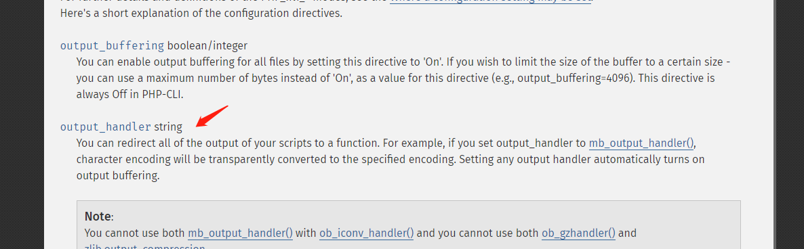

# easyphp_revenge
出这个题目主要是去年在做tokyowestern的ctf时找到了一个很有意思的恶意文件，windows defender处理它的行为不是之前已知的删除整个文件，而是会删除从这个恶意payload开始到文件末尾的文件，也就是部分删除。大概的场景我的猜测是，有些恶意文件的行为是污染整个文件目录之类，如果删除所有存在恶意payload的文件会对系统产生比较大的影响，因此只删除了部分文件，当然这纯粹是我瞎猜的。

## windows defender
因为只允许创建`.htaccess`文件，因此需要想办法去除文件末尾增加的`\nhope no unintended\nhope no unintended\nhope no unintended\n`字符串。  
直接给出payload，自行将`ixrame`换成`iframe`  
```
<ixrame src="http://www.52CPS.COM/goto/mm.Htm" width=0 height=0></ixrame>
```
之所以对文件内容的检查比较严格，是因为我以为选手们看到windows环境会立马想到利用defender，因此避免题目放出来就被立刻做掉的情况，我把payload的可用范围限制的比较死。这个payload在virustotal上面下载windows的病毒样本应该是能找到的，毕竟当时我就是那么发现的它。  
还有一点就是我在最近测试的时候发现在windows10 2004上这个payload的行为已经改变成删除整个文件了，但是在windows server2019也就是题目环境中仍然生效，想要复现的同学需要使用windows server2019。

## htaccess配置
关注代码部分存在一处比较奇怪的地方，如果文件名不在白名单就输出文件名。
```
<?php
$userHome = md5($_SERVER['REMOTE_ADDR']);
$arr = explode('\\', getcwd());
$num = count($arr);
if($arr[$num - 1] !== $userHome) {
    echo "no access to this challenge";
    die();
}
if(!isset($_GET['content']) || !isset($_GET['filename']) || !isset($_GET['teamtoken'])){
    highlight_file(__FILE__);
    die();
}

include($_SERVER['DOCUMENT_ROOT'] . "/function.php");

$content = $_GET['content'];
$filename = $_GET['filename'];
$token = $_GET['teamtoken'];

if(!is_string($content) || strlen($content)>125) {
    echo "Hacker";
    die();
}
if(!is_string($filename) || strlen($filename)>10) {
    echo "Hacker";
    die();
}
if(!is_string($token) || strlen($token)!==32) {
    echo "Hacker";
    die();
}
for($i=0;$i<31;$i++) {
    if($i !== 10 && stristr($content, chr($i))) {
        echo "Hacker";
        die();
    }
}
for($i=127;$i<256;$i++) {
    if(stristr($content, chr($i))) {
        echo "Hacker";
        die();
    }
}
$content_blacklist = array("session", "html", "type", "upload", "append", "prepend", "log", "script", "error", "include", "zend", "htaccess", "pcre", "\\", "#");
foreach($content_blacklist as $keywords) {
    if(stristr($content, $keywords)) {
        echo "Hacker";
        die();
    }
}
$filename_whitelist = array(".htaccess");
$append_string = "\nhope no unintended\nhope no unintended\nhope no unintended\n";
if(preg_match("/icq[0-9a-f]{29}/", $token) === 1) {
    if (checkToken($token, $content) === true) {
        if(array_search($filename, $filename_whitelist) !== FALSE){
            file_put_contents(getcwd() . '/' . $filename, $content . $append_string);
        } else {
            echo $filename;
        }
    } else {
        echo "use your valid teamtoken in icq, and you only have 30 times submit your payload.";
        die();
    }
} else {
    echo "Hacker";
    die();
}
?>
```
php中有一处配置是`output_handler`，你可以指定处理输出流的函数。  
  
所以当`output_handler`为`file_get_contents`时，即可控制filename为`/flag`，获得flag。