# oooooooldjs writeup 
## TL;DR

1. 前置知识
   1. express-validator sanitizer的代码逻辑分析
   2. lodash < 4.17.17 _set 原型链污染
2. 漏洞分析
   1. express-validator sanitizer触发原型链污染
   2. CVE-2015-9251 bypass by prototype pollution
   3. 复习异步编程小知识
   4. 跨域问题解决
3. exploit.py

## 前置知识

### #1 express-validator sanitizer 代码逻辑

讲故事前有必要先了解下express-validator是如何做参数过滤的。就是比如一个express的中间件下面这样写的时候，到底做了什么。

```javascript
body('*').trim()
```

首先在`src/middlewares/validation-chain-builders.js`文件中找到`body`的实现，发现包括`check,body,cookie`等都是对`buildCheckFunction`函数的封装，而``buildCheckFunction``函数内部，调用了`check.js`中的check函数。

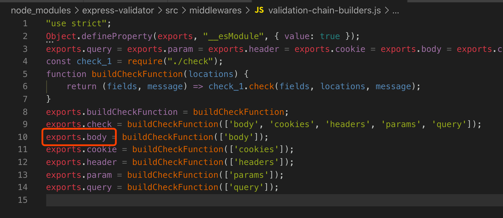

跟进`check.js`。

`src/middlewares/check.js`

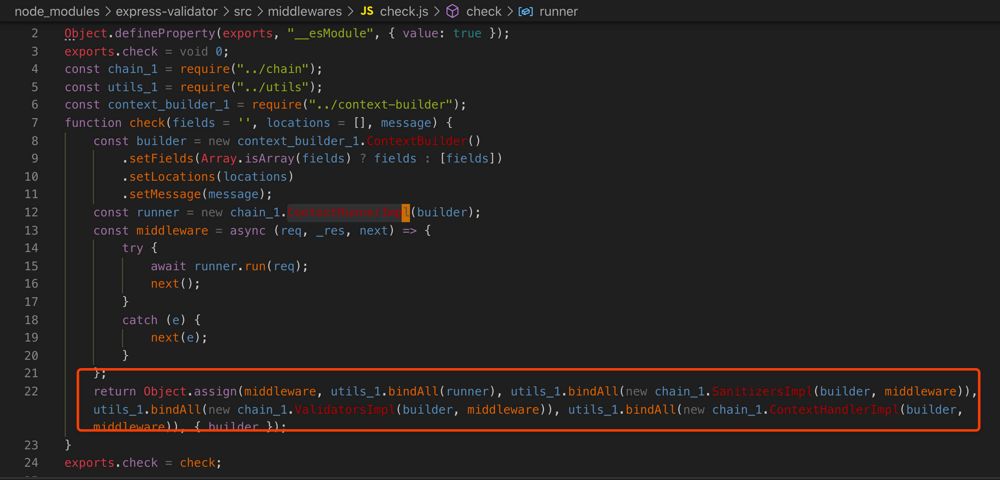

先看return的地方，check函数里的`middleware`就是`express-validator`最终对接`express`的中间件。`utils_1.bindAll`函数做的事情就是把对象原型链上的函数绑定成了对象的一个属性，因为`Object.assign`只做浅拷贝，`utils.bindAll`之后`Object.assign`就可以

把`sanitizers`和`validators`上面的方法都拷贝到`middleware`上面了，这样就能通过这个`middleware`调用所有的验证和过滤函数。

跟进`/src/chain/sanitizers-impl.js`

SanitizersImpl->trim()

SanitizersImpl-> addStandardSanitization()

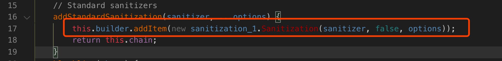

可以看到最终调用`builder.addItem()`，传入`validator.js`的`trim`函数`validator.trim`作为参数，这样就给`builder`增加了一个`sanitization`，然后返回`this.chain`，即`middleware`，这样就做到链式调用。

跟进看看这个`sanitization`做了什么事情，

src/context-items/sanitization.js

Sanitization->run()

context.setData()

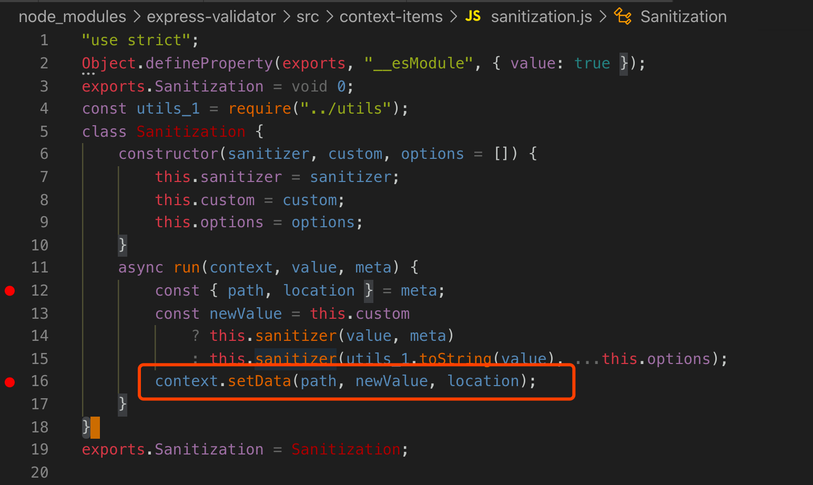

有个`run`方法，调用传入的`sanitizer`，然后调用`context.setData`方法修改新的值。

那么这个`run`方法肯定是在哪里调用了。回头看最外层的`ContextRunnerImpl`做了什么事情。

src/chain/context-runner-impl.js

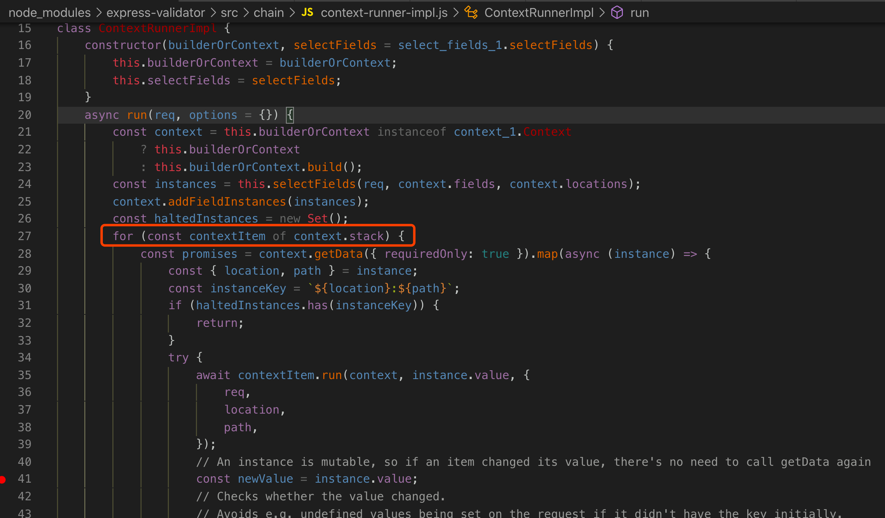

`ContextRunnerImpl`的`run`方法在之前`check()`函数中可以看到是`middleware`调用的入口，这个`run`方法首先申请了一个`context`，可以理解为一个http请求的上下文的一个封装，然后做了一些获取http请求参数的事情。这里可以先不管，焦点放在27行，这个for循环会遍历`context.stack`里的项目，然后调用它的`run`方法。那么这个`context.stack`是什么时候添加的呢？其实就是通过`builder.addItem()`方法添加的，可以看看`builder`都有哪些方法。

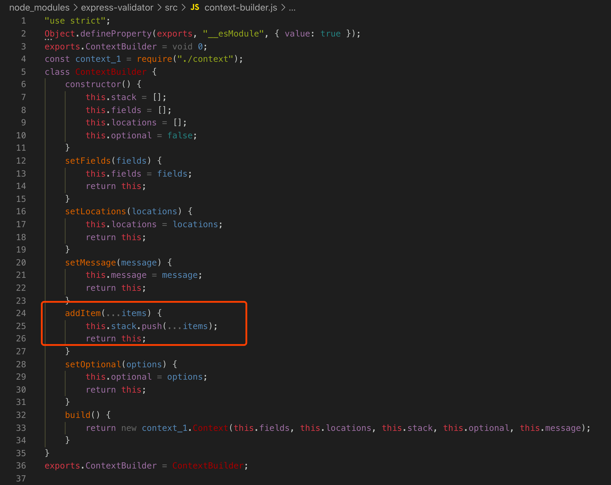

到这里整个大逻辑就清晰了。

`express-validator`的做法是把各种`validator`和`sanitizers`的方法绑定到`check函数`返回的`middleware`上，这些`validator`和`sanitizer`的方法通过往`context.stack`属性里面push `context-items`，最终在`ContextRunnerImpl.run()`方法里遍历`context.stack`上面的`context-items`，逐一调用`run`方法实现`validation`或者是`sanitization`。

### #2 lodash < 4.17.17 原型链污染

https://snyk.io/vuln/SNYK-JS-LODASH-608086

```javascript
lod = require('lodash')
lod.setWith({}, "__proto__[test]", "123")
lod.set({}, "__proto__[test2]", "456")
console.log(Object.prototype)
```
## 二、漏洞分析

### #1 express-validator中lodash原型链污染漏洞攻击面

在上面分析里，`context-runner-impl.js`的run方法中，可以看到如果`options.dryRun`不为真且`reqValue !== instance.value`就会进入条件，通过`_.set`重新设置置`req[location]`的某个参数的值为新的值，这里的参数都是可控的，而且6.6.0版本中要求的lodash最低版本是4.17.15，就有机会触发原型链污染漏洞！

两个条件其中`options.dryRun`默认为false不用管，而要满足`reqValue !== instance.value`的条件，通过调试可以知道，就是使我们给的参数的值经过`sanitizer`之后改变了就行，这里就不具体分析了。

以`check().trim()`这个`sanitizer`来举例子，我们只要给的参数两边具有空白字符，经过`trim()`之后会把空白字符去掉，就可以满足上面的漏洞触发条件，那么是不是我们传入下面这个参数给它，那么就能触发原型链污染呢？

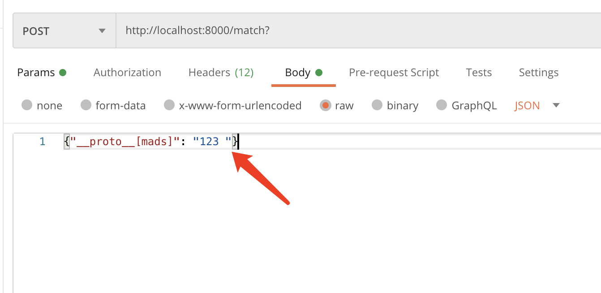

发现确实满足了条件，但是却没有污染成功。

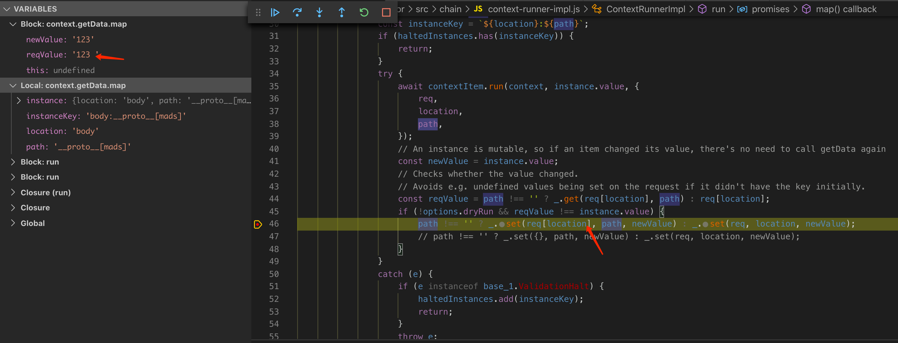

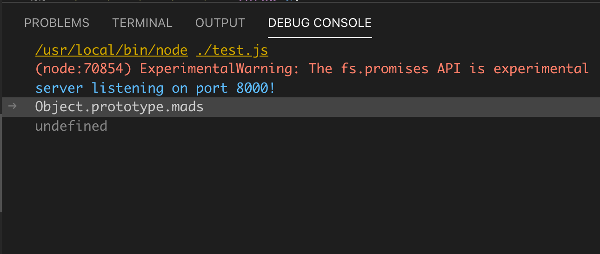

这是为什么呢？这里的用法和poc的不同点，就是这里的`_set`的第一个参数和lodash原型链污染给出的poc不太一样，poc里是空对象，而这里是`req[location]`，而`req[location]`里面本来就是有我们`_set`的第二个参数也就是需要设置的对象的`key`的，是不是因为`key`存在了导致了原型链污染失败呢？

可以用下面的代码来验证

```javascript
// lodash <= 4.17.16
var _ = require('lodash')
var c = {"__proto__[test]": 1}
_.set(c,'__proto__[test]', 2)
console.log(Object.prototype)
// result: {}
```

发现确实是这个问题。到这里似乎感觉这个触发点走不通了，但是感觉有时候不可靠，继续动手继续调一下/狗头

先想一下，目前这条路遇到的问题就是，我们需要把恶意的`key`传递给lodash的`_set`作为第二个参数，而这个恶意的`key`本身是通过`req`的参数传过去的，所以会事先保存到`_.set`的第一个参数`req[location]`里面，导致原型链污染失败。那么有没有可能这个`key`在走到`_set`之前的某个时候，经过了`express-validator`的一些处理发生了一些（奇特的）变化导致和`req[location]`里的`key`不一样了呢？这样的话`_set`就可以污染成功了。

废话不多说，定位到`ContextRunnerImpl.js`代码中，在调用`context.stack`中的各种过滤器和`sanitizer`之前，调了一个`this.selectFields`函数，这个函数的作用其实就是根据我们传入`check()`的参数，也就是http请求的参数`key`，获取对应的值并封装成`instance`对象返回。代码在`src/select-fields.js`中，可以看到在其中的`expandPath`函数中对`key`动了手脚。代码如图

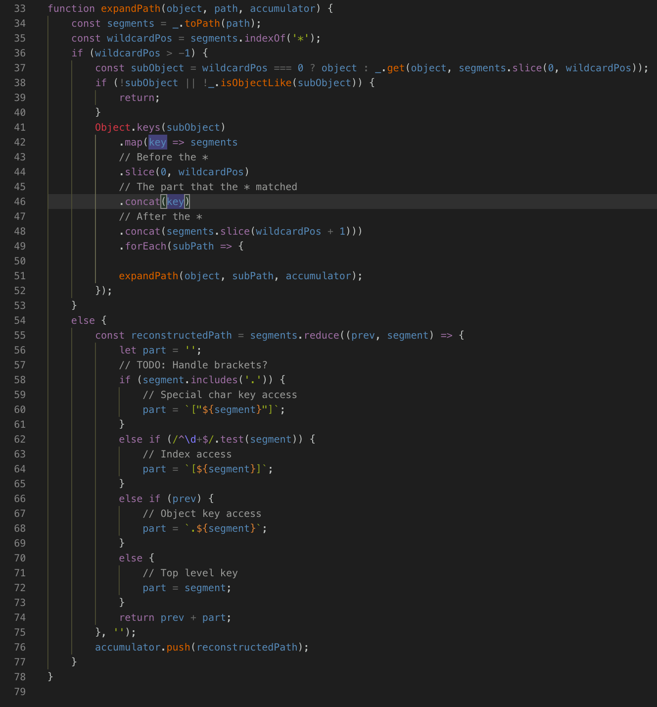

这个函数处理的第二句是因为express-validator的check参数支持通配符`wildcard`的写法，大概意思就是当`body("a.*")`这样写的话，就可以对body中a对象里面的所有属性进行验证，比如下面的body参数

```
{"a": {"b":"123"}}
```

就可以对b的内容进行验证。但是如果我们这样写

```
{"a.b":"123"}
```

express-validator其实是不会对`a.b`进行验证的，因为这里的`a.b`相当于是一个`key`，在传入`express`的时候并不会进行自动的`unflatten`而变成一个a对象包含一个b对象。但是`express-validator`内部都是通过lodash的`_get`和`_set`对对象进行赋值和取值，当传入类似`a.b`这种`key`给`_set`的时候，lodash会误以为给某对象的a对象的b对象进行赋值，所以会先创建a对象，然后创建b对象，最后进行赋值，而不是单纯的给某对象的`a.b`这个key进行赋值。为了防止这种误操作的情况出现，`express-validator`也是对key进行了检查，当存在特殊字符的时候会进行一些处理，也就是前面提到的对`key`动的手脚XD

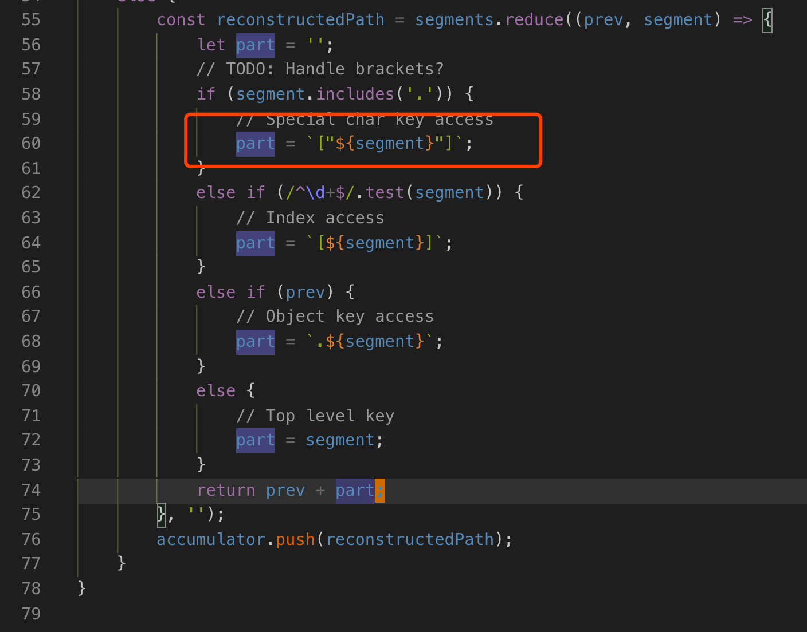

图里的`segment`就是key，可以看到经过这段代码的处理，带`.`的的项都被`[""]`包裹起来了，相当于把key给"转义"了一下，防止用户在传入带`.`的key的参数在赋值时赋错了，并且还可以防止原型链污染。可以用下面的代码验证。

```javascript
// lodash <= 4.17.16
var _ = require('lodash')
var c = {}
// _.set(c,'a.b', 1)
// console.log(c)
// { a: { b: 1 } }
_.set(c,'["a.b"]', 1)
console.log(c)
// { 'a.b': 1 }
```

但是，但是，这里是可以bypass的！原因就是出在这里用的是javascript的模版字符串的写法，比如我们传入这样的key的时候

```
{"\"].a[\"b": "123 "}
```

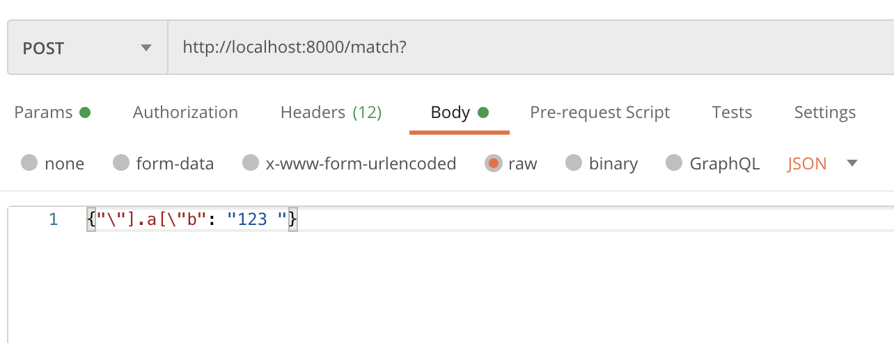

在经过处理之后到`_set`之后

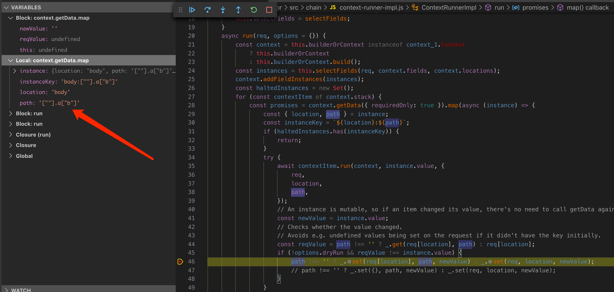

发现成功变成了

```
'[""].a["b"]'
```

而这个传入`_set`之后，由于`req[location]`中不存在这个key，所以就可以成功设置`req[locaiton]`的。。。的。。。什么key呢？可以用下面代码测试一下

```javascript
// lodash <= 4.17.16
var _ = require('lodash')
var c = {}
_.set(c,'[""].a["b"]', 1)
console.log(c)
// { '': { a: { b: 1 } } }
```

可以看出是设置了空字符key这个对象下的a对象的b属性的值。那么改下payload

```
{"\"].__proto__[\"mads": "123 "}
```

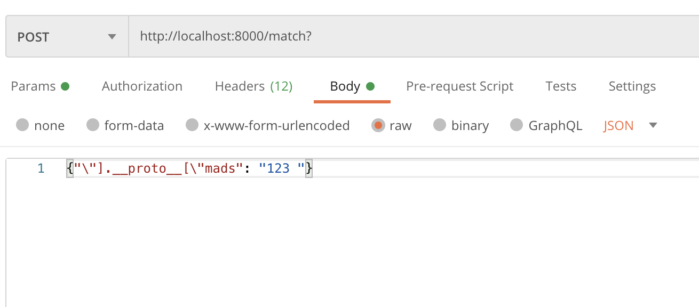

发送

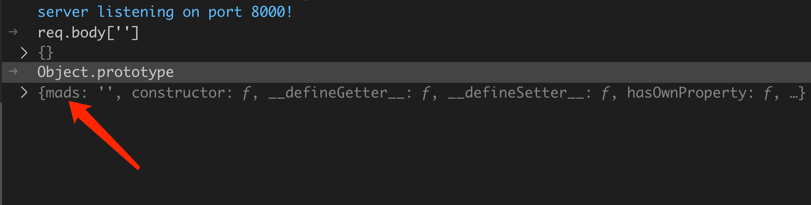

发现成功污染了原型，增加了一个`mads`参数，但是好像值有点不对劲。这里往后调一下就知道，是因为在`_set`的时候用的第三个参数`newValue`是利用变化后的`key`重新从`req[location]`取出来的。但取出来本应该是`undefined`，但是别忘了，因为我们用了`sanitizer`，所以这个`undefined`会经过`sanitizer`的处理，处理代码如下

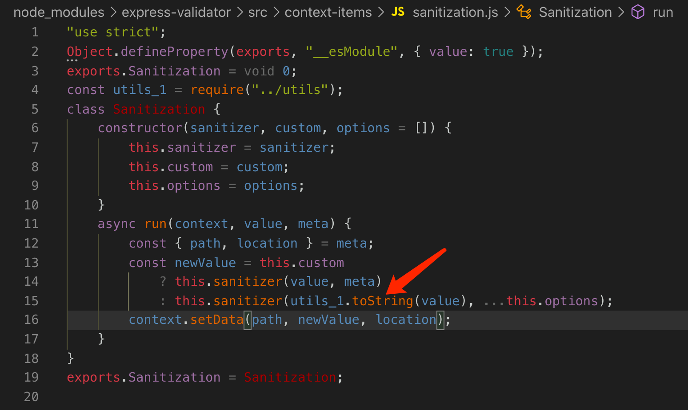

不出我们所料，`undefined`经过处理后成功变成了空字符串`''`，就是图中箭头所指向的`toString()`函数的功能。而前面提到的`reqValue`，也会从`req[location]`重新get一下，而这个get到的`undefined`不会被处理而保留。而`undefined !== ''`的结果为真，于是经过这一番折腾，依然满足`_set`的条件，可以成功进行原型链的参数污染，只是被污染的key的值，只能是空字符串`''`。

但就是这一个空字符串，因为Javascript的一些特性，可以具备很强大的威力。比如if判断中，`''`字符串会返回false，这就是说我们可以把某些地方的本来为`真`的条件判断改为`假`,**从而绕过某些限制或者改变代码走向。**

总结一下，通过这个攻击面，我们目前拥有的是有限的原型链污染能力，即污染原型链上(任意对象的)任意属性为空字符串`''`。

### #2 复活jQuery中的远古RCE恶龙

https://snyk.io/vuln/npm:jquery:20150627

https://www.cvedetails.com/cve/CVE-2015-9251/

CVE-2015-9251简单来说就是当`jQuery`的url返回的头的`content-type:`字段为` text/javascript`的时候，即使没有设置`dataType: 'script'`，也会自动`eval`返回内容。

也就是说这个漏洞能做到控制了`ajax`的url就可以RCE（前端是XSS，放在后端自然就是RCE），极其强大。可惜的是在`jquery 3.0.0`就修复了。题目中用的jQuery也是最新的没有这个漏洞。但是可以看看修复[代码](https://github.com/jquery/jquery/blob/5c2d08704e289dd2745bcb0557b35a9c0e6af4a4/src/ajax/script.js#L23)是怎么样的

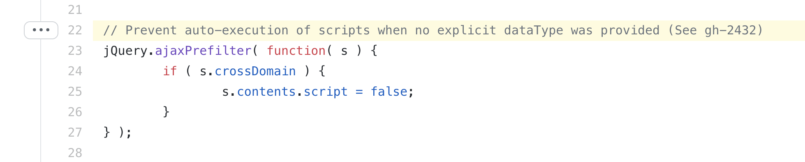

通过判断`s.crossDomain`这个变量的`真/假`，如果是真，就会设置返回内容不可自动执行。

而这个s.crossDomain在JQuery的默认设置里面是不存在的，在JQuery对象初始化时候，用到了`jQuery.ajaxExtend`函数

dist/jquery.js

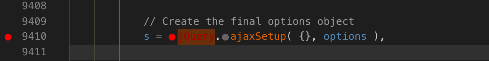

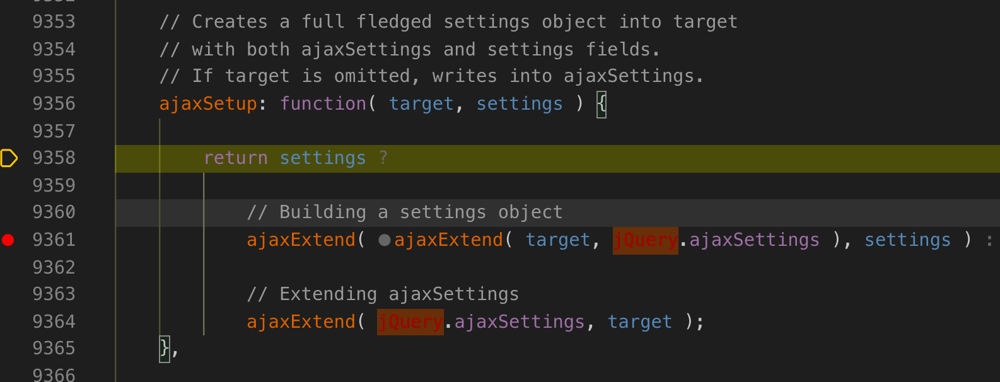

这个函数内部是用`for in`的方式来遍历`src`的key的，

dist/jquery.js

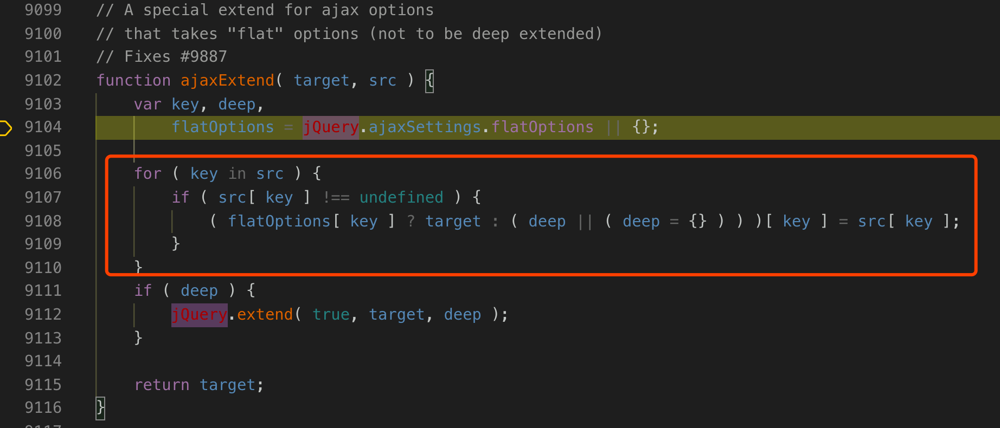这种方式会去拿对象本身不存在但是原型链上存在的key，而这时原型链上如果存在被污染的`crossDomain`，就会被赋值给`target`，可以用下面的代码来验证

```javascript
Object.prototype.polluted = ''
let a = {}
let c = {}
for( key in c){
    a[key] = c[key]
}

console.log(Object.keys(a))
// [ 'polluted' ]
console.log(a)
// { polluted: '' }
```

于是经过`ajaxExtend`的操作，`s.crossDomain`被覆盖成了原型链上被污染的值`''`，这导致在后续对`s.crossDomain`真正赋值的时候出现问题，

赋值的地方长这个样子

src/ajax.js

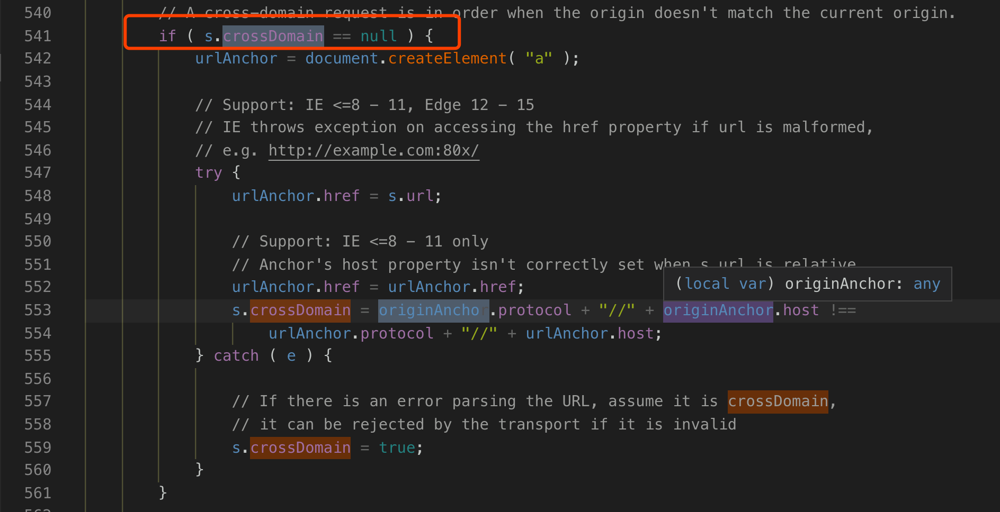

因为默认配置里`s.crossDomain`没有初始化是`undefined`，然后`undefined == null`是true，所以这里正常情况下可以进入这个判断，设置`s.crossDomain`为相应的值。但是经过上面一通操作现在`s.crossDomain`已经变成了`''`，`if(s.crossDomain == null)`就会失败，从而不会进入判断，而保留`s.crossDomain = ''`。

再看看上面的修复代码，当`s.crossDomain = ''`的时候，`if(s.crossDomain)`也会返回`假`,导致不会进入判断，成功绕过了CVE-2015-9251。

> 这里由于ajaxExtend的for..in写法，如果拥有正常的原型链污染，就可以覆盖s的任意配置为任意值，包括url和method等。

总结一下，结合#1中的原型链污染以及jQuery中的一个gadgets，可以成功RCE，目前利用条件变为：

- 控制jQuery的ajax请求的url

### # 3 典型的异步编程陷阱

在我们初学JavaScript的时候，是不是也遇到过一些和异步函数相关的很反常识的bug呢？这题的`entity.js`里`DataRepository.D`方法的实现就有问题，

entity.js

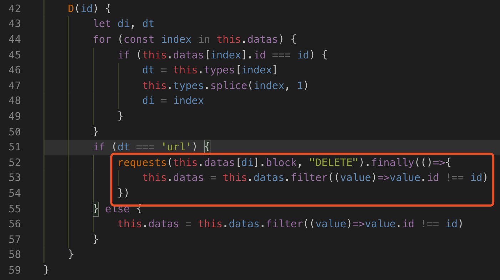

这里的`requests`是一个异步函数，在删除`this.types`数组对应的项之后，由于异步函数的特性，`express`不会等待`requests`而继续执行下面的代码，所以`this.datas`中对应的项的删除也被相应的异步延后了。这样一来，就会在某一时刻，`this.datas`和`this.types`长这个样子(以默认的项为例，删除`fake-uuid`)

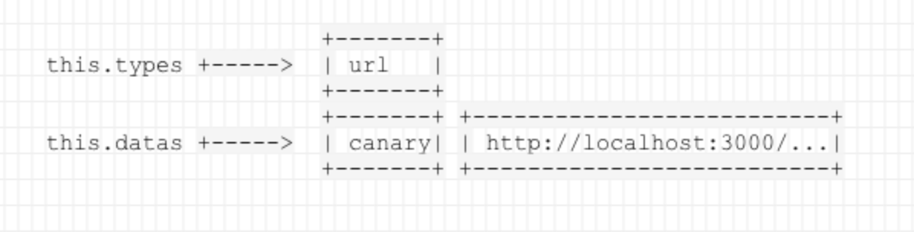

这个时候如果我们抓住机会访问`GET /data/fake-uuid`，`dataRepo.R`的返回结果就会长这个样子

```json
[
"url",
"canary
]
```

所以我们只要利用异步函数导致的数据不一致，发送一些恶意请求，构造`this.types`和`this.datas`中间某一段大概像下面图这个样子（错位），最后发起`GET /data/xx1`请求，就可以让题目访问我们自己的url。

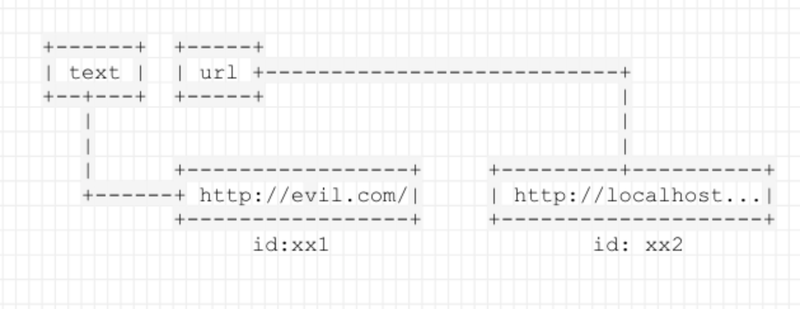

最后注意一点就是，因为后端request请求的是本地回环比较快，所以为了在`dataRepo.D`中requests没结束时构造好我们想要的数据模样，需要`dataRepo.D`中requests的耗时比我们构造的时间久，有个想法是可以先post一些链表形式串起来的数据，如下图，

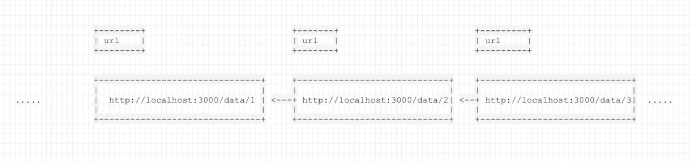

然后再发起链表头数据的`DELETE`请求，让requests进行递归的删除，这样就可以通过这个链表的长度从而控制requests花费的时间，以让requests耗费的时间符合我们的预期。

> 链表实际的长度需要根据不同的网络状况调整，目标就是**让后端dataRepo.D的requests在我们构造包发送完时候还没处理完**的情况下越小越好（节约时间嘛

> 测试会发现this.types和this.blocks的长度相差为3的情况比较稳定，我的推测是nodejs是分了两个线程来处理xhr的异步请求？具体没有去分析，属于猜想（但线程数肯定是有限的嘛，所以这里的错位的位数肯定是一个固定的值）。体现在exploit里就可以设置y>=3，x一直增大到满足条件即可构造成功。

> 所以如果网络比较差，这个链就需要POST的比较久，还有可能被平台的waf拦截（waf拦截的是太快的请求，所以POST链的时候设置一下发送频率就可以过waf，但可能就比较久/哭

### #4 跨域问题解决

自己的恶意url响应头按照CVE-2015-9251设置`Content-Type: text/javascript`，会报下面这样的错误

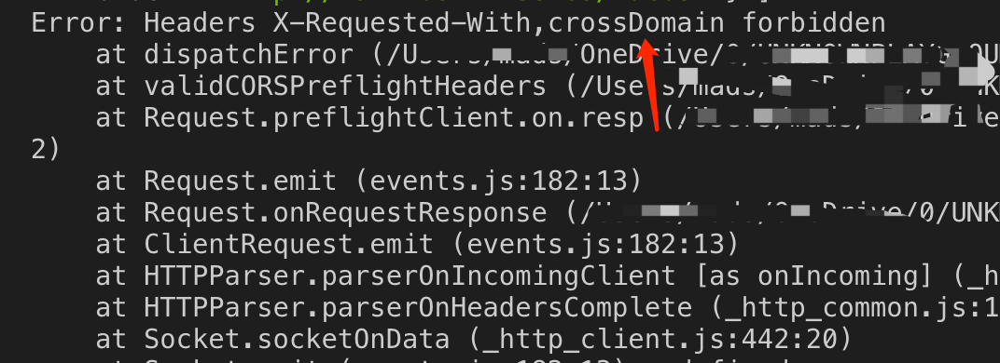

解决办法很简单，就是在我们自己url返回内容的时候加上这两个返回头，另外再设置一个允许跨域访问的返回头就可以啦。

```javascript
res.setHeader("Content-Type", "text/javascript")
res.setHeader("Access-Control-Allow-Origin", "*")
res.setHeader("Access-Control-Allow-Headers", "X-Requested-With, crossDomain")
```

## exploit

- [exploit.py](exploit.py)
- [cmd.js](cmd.js)

## reference

- Lodash < 4.17.17 Prototype Pollution https://snyk.io/vuln/SNYK-JS-LODASH-608086
- CVE-2015-9251 https://www.cvedetails.com/cve/CVE-2015-9251/


